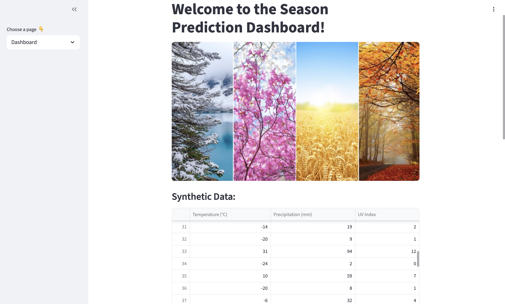
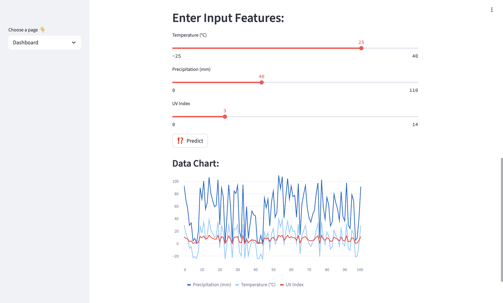
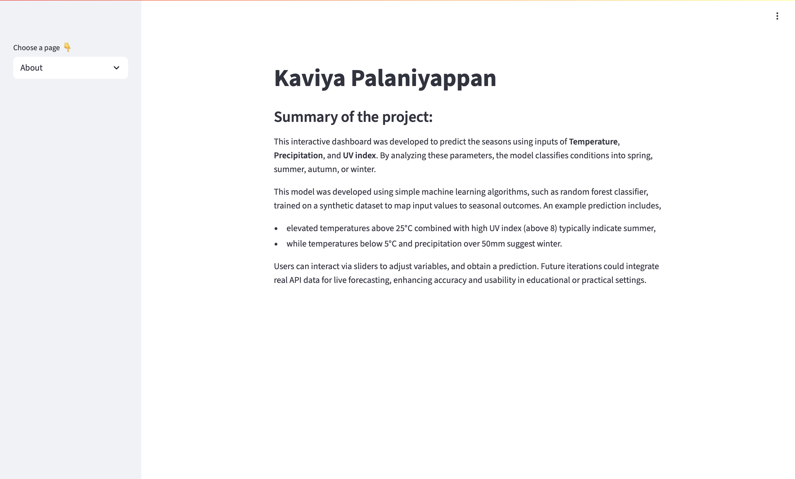

# SEASON PREDICTION DASHBOARD

**Author**: Kaviya Palaniyappan








## Project Description:

1. This project uses Streamlit to develop an interactive dashboard design, used to predict the seasons of the year. 
2. The dasboard contains a table consisting of data points to be used in the prediction task. 
3. It has **3 input features**, Temperature, Precipitation and UV Index, where the values are entered using a slider widget. 
4. It also displays a chart which shows the trends between the data points.

## System description:

The system consists of:

1. **"Dashboard.py"** - main file of the dashboard
2. **"assets"** - folder containing images and screenshots
3. **"README.md"** - file containing description of the project

### Installation of libraries

Run the commands below in a terminal to configure the project and install the package dependencies for the first time.

If you are using Mac, you may need to install Xcode. Check the official Streamlit documentation [here](https://docs.streamlit.io/get-started/installation/command-line#prerequisites).

1. Create the environment with `python -m venv env`
2. Activate the virtual environment for Python
   - [Linux/Mac] `source env/bin/activate` 
3. Make sure that your terminal is in the environment (`env`) not in the global Python installation. The terminal should start with the word `env`
4. Install required packages `pip install -r ./requirements.txt`
5. Check that the installation works running `streamlit hello`
6. Stop the terminal by pressing **Ctrl+C**

### Execute custom Dashboard

First, make sure that you are running Python from the environment. Check the steps 2 and 3 above. Then, to run the custom dashboard execute the following command:

```
> streamlit run Dashboard.py
# If the command above fails, use:
> python -m streamlit run Dashboard.py
```

### Dependencies

Tested on Python 3.12.7 with the following packages:
  - Jupyter v1.1.1
  - Streamlit v1.46.1
  - Seaborn v0.13.2
  - Plotly v6.2.0
  - Scikit-Learn v1.7.0
  - shap v0.48.0
